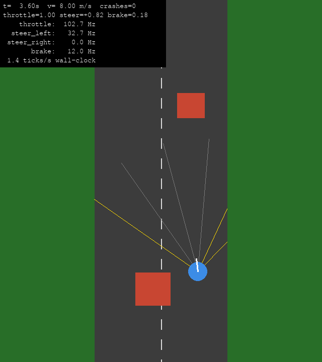

# FruitFly – ein Fliegengehirn fährt Auto

`fly_driver.py` koppelt das Ganzhirn-Modell der Fruchtfliege
([eonsystemspbc/fly-brain](https://github.com/eonsystemspbc/fly-brain):
Leaky-Integrate-and-Fire-Netz nach Shiu et al., *Nature* 2024, auf dem
FlyWire-Konnektom v783, 138 639 Neuronen, 15 Mio. Verbindungen) an eine
einfache 2D-Autosimulation in pygame.

```
Distanzsensoren links/rechts ──► Poisson-Raten sensorischer Neuronen (LC6 links/rechts)
        ▲                                   │
        │                                   ▼
   Auto (Gas, Lenkung, Bremse)   Gehirnsimulation, 30 ms pro Schritt (PyTorch, CUDA falls vorhanden)
        ▲                                   │
        └── Feuerraten: P9 → Gas, DNa01/DNa02 L/R → Lenkung, MDN → Bremse
```

## Einrichtung

```bash
# Gehirnmodell und Daten (100 MB Konnektom) neben dieses Repo klonen
git clone https://github.com/eonsystemspbc/fly-brain ../fly-brain

# Variante A: die Umgebung von fly-brain + pygame/pyyaml
conda env create -f ../fly-brain/environment.yml
conda activate brain-fly
pip install pygame pyyaml pytest

# Variante B: schlanke Umgebung nur für fly_driver
conda env create -f environment.yml
conda activate fly-driver

# optional: FlyWire-Annotationen (Zelltypen, Seite), nur für
# {select: ...}-Neuronenangaben in der Config und tools/screen_sensory.py
git clone --depth 1 https://github.com/flyconnectome/flywire_annotations ../flywire_annotations
```

Der Pfad zu fly-brain steht in `fly_driver_config.yaml` (`brain.fly_brain_dir`)
und kann mit der Umgebungsvariable `FLY_BRAIN_DIR` überschrieben werden.

## Beispiel: Zucker-Neuronen aktivieren, Motorneuronen beobachten

```bash
python examples/sugar_motor_neurons.py --t-run 1 --trials 4
```

Die 21 labellaren Zucker-GRNs werden mit 200 Hz Poisson gereizt:

| Neuron | Rate [Hz] | Referenz `main.py --pytorch` |
|---|---|---|
| MN9 (Rüssel-Motorneuron, Fressen) | 88 ± 4 / 62 ± 7 | 95 / 70 |
| P9, oDN1, DNa01, DNa02, MDN, Giant Fiber | 0 | 0 |

Wie im Paper: Zucker löst das Fressprogramm (MN9) aus, die Lauf-Neuronen
bleiben still. Die Referenzspalte stammt aus
`python main.py --pytorch --t_run 1 --n_run 1` in fly-brain und lässt sich mit
`python examples/sugar_motor_neurons.py --parquet ../fly-brain/data/results/pytorch_t1.0s_n1.parquet`
auswerten.

## Fahren

```bash
python fly_driver.py                               # Fenster, ESC beendet
python fly_driver.py --headless --ticks 300 --log run.csv
python fly_driver.py --step-ms 50 --device cuda
python fly_driver.py --brain reflex                # Braitenberg-Ersatzregler ohne Konnektom (Debug)
```

Pro Steuerschritt (`brain.step_ms`, 20–50 ms, Standard 30 ms):

1. **Sensoren**: je Seite drei Strahlen (±10°, 30°, 50°, Reichweite 12 m) gegen
   Straßenrand und Hindernisse. Nähe `p = 1 − d/Reichweite`, unterhalb von
   `threshold` = 0, darüber `rate = min + (max − min) · p^gamma` (bis 200 Hz).
2. **Stimulation**: die Rate wird als Poisson-Eingang auf die sensorischen
   Neuronen der jeweiligen Seite gegeben (dieselbe Poisson-Kopplung wie in
   fly-brain: 250 × 0,275 mV pro Eingangsspike).
3. **Gehirn**: `step_ms` Gehirnzeit mit dt = 0,1 ms; der Netzwerkzustand
   (Membranpotentiale, Synapsen, Verzögerungen) läuft über die Schritte weiter.
4. **Dekodierung**: Spikes jeder Motorgruppe → Rate in Hz → Tiefpass
   (`smoothing_ms`) → `level = clip((rate − offset_hz) / full_scale_hz, 0, 1)`.
   Gas = level(P9), Bremse = level(MDN),
   Lenkung = level(DNa01/02 links) − level(DNa01/02 rechts) (positiv = links).



**Ergebnis mit der Standard-Config** (CPU, Seed 0, 1000 Schritte à 30 ms):
30 s Fahrt, 220 m, **0 Kollisionen**. Die Lenkung korreliert mit r = −0,84
mit der Sensor-Asymmetrie (Hindernis links → Rechtsdrehung).
Kontrolle mit vertauschten Sensorseiten (linker Sensor → LC6 rechts): das
Auto lenkt zur Wand, crasht nach 11 m und bleibt mit voller MDN-Bremse stehen.

Autozeit und Gehirnzeit sind synchron: ein Schritt bewegt das Auto um
`step_ms` weiter, egal wie lange die Berechnung dauert. Auf 4 CPU-Kernen
schafft das Modell ca. 2 Schritte/s (≈ 0,06× Echtzeit); mit CUDA-GPU wird
automatisch das PyTorch-CUDA-Backend genutzt (`brain.device: auto`).

## Neuronen-Zuordnung (`fly_driver_config.yaml`)

Alle Zuordnungen stehen in der Config (YAML oder JSON) und sind austauschbar.
Neuronenlisten akzeptieren

```yaml
neurons: [720575940635872101, 720575940627652358]          # FlyWire-IDs
neurons: {P9_left: 720575940635872101, P9_right: ...}       # Name -> ID
neurons: {select: {cell_type: LC16, side: left}}            # Abfrage der FlyWire-Annotationen
```

| Rolle | Standard | Begründung |
|---|---|---|
| Sensor links / rechts | LC6 links / rechts (visuelle Projektionsneuronen) | treibt im Modell die DNa01/DNa02 der Gegenseite (→ Wegdrehen) und MDN (→ Bremsen) |
| Gas | P9 = DNp09 links/rechts | Vorwärtslaufen (Bidaye et al. 2020) |
| Lenkung | DNa01 + DNa02 je Seite | Drehen zur eigenen Seite (Rayshubskiy et al. 2020, Yang et al. 2023) |
| Bremse | MDN (4 Zellen) | „Moonwalker“, Rückwärtslaufen/Stopp (Bidaye et al. 2014) |
| Tonischer Eingang | P9 mit 100 Hz | Laufmotivation; kein Sensor erregt P9 von selbst (siehe Screening) |

Seitenangaben folgen der FlyWire-Annotationstabelle (Schlegel et al. 2024).
Das Beispiel-Notebook von Shiu et al. benennt P9/DNa01/DNa02 gespiegelt
(z. B. heißt 720575940627652358 dort `P9_left`, in FlyWire `side = right`).
Für das Auto ist nur entscheidend, dass Sensor- und Motorseite derselben
Konvention folgen.

### Auswahl der sensorischen Neuronen

`tools/screen_sensory.py` reizt jede Kandidatenpopulation einzeln (links bzw.
rechts, 200 Hz, 0,3 s, alle Bedingungen parallel als Batch) und misst die
Motorgruppen. Auszug (Raten in Hz, `turn_right_bias` = DNa rechts − DNa links):

| Population | Seite | P9 | DNa links | DNa rechts | MDN | turn_right_bias |
|---|---|---|---|---|---|---|
| Zucker-GRN | rechts | 0 | 35 | 3 | 0 | −32 |
| Bitter-GRN | links | 0 | 12 | 0 | 0 | −12 |
| JO-CE (Wind/Schwerkraft) | links | 0 | 0 | 0 | 0 | 0 |
| Thermosensorisch | links / rechts | 0 | 40 / 32 | 3 / 8 | 0 | −37 / −23 |
| LC4 (Looming) | links / rechts | 0 | 0 / 30 | 30 / 0 | 2 / 2 | +30 / −30 |
| LPLC2 (Looming) | links / rechts | 13 / 0 | 0 / 32 | 20 / 0 | 0 / 1 | +20 / −32 |
| LC16 | links / rechts | 0 | 0 / 57 | 27 / 7 | 0 / 22 | +27 / −50 |
| **LC6** | **links / rechts** | 0 | **0 / 53** | **45 / 0** | **19 / 14** | **+45 / −53** |
| LC9 | links / rechts | 57 / 77 | 7 / 80 | 43 / 28 | 12 / 33 | +37 / −52 |
| LC15 | links / rechts | 0 / 2 | 7 / 50 | 45 / 5 | 0 / 3 | +38 / −45 |

Die visuellen Projektionsneuronen (LC4, LC6, LC15, LC16, LC22, LPLC1/2)
steuern konsequent die DNa-Neuronen der Gegenseite an, also ein Wegdrehen vom
Reiz. LC6 kombiniert das stärkste, sauber lateralisierte Lenksignal mit
beidseitiger MDN-Aktivierung und ist daher Standard. Zum Ausprobieren einfach
`sensors.left.neurons` / `sensors.right.neurons` ersetzen, z. B. durch
`{select: {cell_type: LC16, side: left}}`.

```bash
python tools/screen_sensory.py --t-run 0.3 --out screen.csv   # ~4 min auf CPU
```

## Implementierung

`FlyBrain` übernimmt Gleichungen und Parameter von `code/run_pytorch.py`
(Alpha-Synapse, LIF, Refraktärzeit, 1,8 ms Verzögerung, Poisson-Eingang).
Unterschiede sind rein technisch:

* Rekurrente Eingänge werden ereignisgetrieben berechnet: nur die ausgehenden
  Synapsen der Neuronen, die im Schritt gefeuert haben, werden aufaddiert
  (statt einer vollen Sparse-Matrix-Multiplikation pro 0,1 ms).
* Ringpuffer statt `torch.roll` für die synaptische Verzögerung.
* Zustand bleibt zwischen `run()`-Aufrufen erhalten, Eingangsraten können
  sich pro Schritt ändern.

`tests/test_fly_driver.py` prüft, dass die Spikezüge auf einem Zufallsnetz
bitgenau mit dem Referenz-`TorchModel` übereinstimmen. Auf der CPU ist die
Engine ca. 14× schneller pro Versuch als das Referenz-Backend
(4 × 1 s in 74 s gegenüber 1 × 1 s in 260 s).

```bash
python -m pytest -q tests
```

## Grenzen

* Das Modell hat keine Spontanaktivität und keinen Körper/VNC: „Gas“ braucht
  den tonischen P9-Eingang, die Kopplung Sensor → Verhalten ist eine grobe
  Abstraktion (Distanz → Poisson-Rate), keine realistische visuelle Kodierung.
* Ohne GPU ist die Simulation deutlich langsamer als Echtzeit; das Fenster
  zeigt die Zeit im Gehirn-/Autotakt.
* PyGeNN/Brian2CUDA aus `environment.yml` von fly-brain werden für
  `fly_driver` nicht benötigt.
